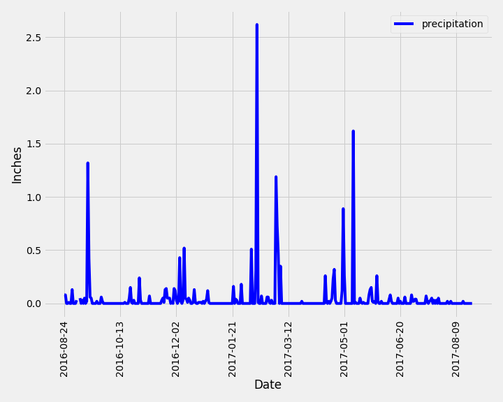
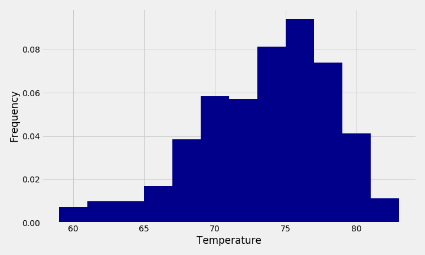

## SQLAlchemy - Surfs Up!

### Climate Analysis and Exploration

Used Python (Pandas, and Matplotlib) and SQLAlchemy to do basic climate analysis and data exploration.

* Choosed a start date and end date for my trip. My vacation range is approximately 3-15 days total.

* Used SQLAlchemy `create_engine` to connect to your sqlite database.

* Used SQLAlchemy `automap_base()` to reflect my tables into classes and save a reference to those classes called `Station` and `Measurement`.

### Precipitation Analysis

* Designed a query to retrieve the last 12 months of precipitation data.

* Loaded the query results into a Pandas DataFrame and set the index to the date column.

* Sorted the DataFrame values by `date`.

* Ploting the results using the DataFrame `plot` method.

  

### Station Analysis

* Designed a query to calculate the total number of stations.

* Designed a query to find the most active stations.

  * Listed the stations and observation counts in descending order.

  * Which station has the highest number of observations?

* Designed a query to retrieve the last 12 months of temperature observation data (TOBS).

  * Filtered by the station with the highest number of observations.

  * Ploting the results as a histogram with `bins=12`.

    

- - -

### Climate App

Designed a Flask API based on the queries that I have just developed.

* Used Flask to create my **routes**.

- - -